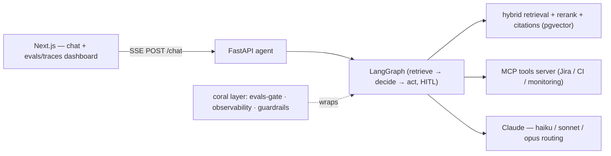

# OncallPilot

Production-grade agentic assistant for **SRE / on-call operations**: answers questions from internal docs (RAG) **and** takes actions (create a Jira ticket, check CI, query monitoring) via tools exposed over **MCP** — with source citations and a human confirmation before any destructive action.

The point of the project is the **production contour** ("coral layer"), not another RAG demo: **evals as a blocking CI gate · observability (cost / latency / tokens per request) · guardrails (prompt injection incl. indirect, PII, tool allowlist, human-in-the-loop, abuse/spend caps) mapped to the OWASP LLM Top-10.**

> **Status: Phase 0 (skeleton).** Next.js chat ↔ FastAPI ↔ one streamed Claude call, edge rate-limit + spend-cap, deployable. RAG, the LangGraph agent, MCP tools, evals, and the observability/guardrail layer land in P1–P4. See the roadmap below and `DECISIONS.md`.

## Architecture (target)



Phase 0 implements only `UI → API → CLAUDE` (single streamed call) plus the edge guard.

## Stack

Python (FastAPI + LangGraph + RAGAS) · Next.js 15 (React + Tailwind) · Claude (Anthropic) with model routing · Postgres 16 + pgvector · Docker + Fly.io · GitHub Actions.

## Quickstart (local)

Requires Docker, or: Python 3.10 + [uv](https://docs.astral.sh/uv/) + Node 22.

```bash
cp .env.example .env
# set ANTHROPIC_API_KEY=... in .env  (the only required secret in P0)

# Option A — everything in Docker:
make up                 # → web http://localhost:3000 , agent http://localhost:8000

# Option B — run each locally:
make bootstrap          # installs uv + agent/web deps
make agent-dev          # agent with reload on :8000
make web                # web on :3000
```

Without `ANTHROPIC_API_KEY`, the agent still boots: `/healthz` is green, `/readyz` returns 503, and `/chat` returns a clear 503 — so you can verify the plumbing before wiring a key.

### Endpoints (agent)

| Method | Path      | Purpose                                             |
|--------|-----------|-----------------------------------------------------|
| GET    | `/healthz`| liveness (always 200)                               |
| GET    | `/readyz` | readiness (503 until `ANTHROPIC_API_KEY` is set)    |
| POST   | `/chat`   | one streamed Claude completion over SSE, edge-guarded|

`POST /chat` body: `{"query": "...", "conversation_id": "..."}` → SSE events `token` / `usage` / `done` / `error`.

## Tests & lint

```bash
make test     # agent unit tests (health, edge-guard, SSE plumbing via a fake client)
make lint     # ruff + mypy (agent), tsc (web)
```

## Deploy

`ops/fly/*.fly.toml` + `.github/workflows/deploy.yml` deploy `agent` and `web` to Fly.io on a `v*` tag (needs `FLY_API_TOKEN` + pre-created apps). The agent runs always-on (SSE); no database in P0.

## Roadmap

| Phase | What |
|-------|------|
| **P0** ✅ | skeleton: chat ↔ FastAPI ↔ one streamed Claude call + edge guard, deployed |
| P1 | RAG: ingest, hybrid retrieval + rerank, cited answers, grounded refusal |
| P2 | LangGraph agent + 3 MCP tools, multi-step, human-in-the-loop on destructive |
| P3 | evals: golden dataset + RAGAS + custom checks as a blocking CI gate |
| P4 | observability + guardrails: tracing, cost/latency per request, injection/PII, OWASP map |
| P5 | polish: README demo GIF, live link, Loom |

Design reasoning lives in [`DECISIONS.md`](./DECISIONS.md).
