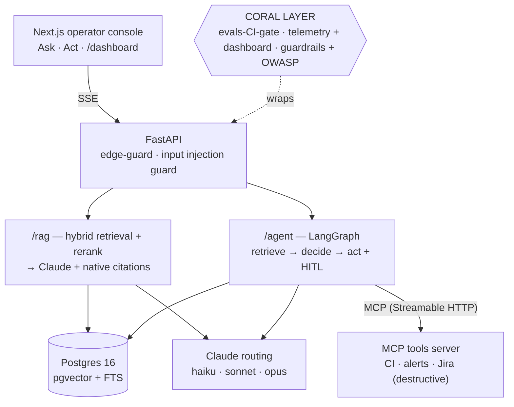

# OncallPilot

A production-grade agentic assistant for **SRE / on-call operations**. It answers
questions from internal runbooks **with cited sources** (RAG), and it **takes
actions** — check CI status, query monitoring alerts, file an incident ticket —
via tools exposed over **MCP**, pausing for **human approval** before anything
destructive.

The point isn't another RAG demo. It's the **production contour** ("coral layer")
that separates a real tool from a tutorial: **evals as a blocking CI gate ·
per-request observability (cost / latency / tokens) · guardrails (prompt
injection, PII, human-in-the-loop) mapped to the OWASP LLM Top-10.**

> **Status: feature-complete (P0–P4).** RAG, the LangGraph agent + MCP tools with
> human-in-the-loop, the evals gate, observability, and guardrails are all built
> and verified end-to-end on live Claude. Remaining: deploy (P5) — see
> [`docs/DEPLOY.md`](docs/DEPLOY.md).

## Architecture



## What it does — two flows

**Ask** (grounded Q&A): *"Redis is at 95% memory and rejecting writes with OOM —
first steps?"* → retrieves `runbooks/redis-oom`, answers with **that runbook's
exact steps** (`maxmemory-policy allkeys-lru`, `--bigkeys`, …) and **clickable
citations** to the source spans.

**Act** (agent + human-in-the-loop): *"The api-deploy CI is red — file an SRE
incident."* → the agent checks CI (`get_ci_status`), sees the failed run, queries
alerts, then proposes `create_jira_ticket` and **pauses**. The operator clicks
**Approve** → the ticket is created (`SRE-4201`) — idempotent, so a retry never
double-files.

## Key features

- **Production RAG** — hybrid dense (`pgvector`) + Postgres FTS fused with
  Reciprocal Rank Fusion, cross-encoder rerank available, and **native Anthropic
  Citations** (real source spans, not model-asserted footnotes). Grounded refusal
  when the corpus doesn't cover a question.
- **Agentic tool use with human-in-the-loop** — a LangGraph `retrieve → decide →
  act` graph over 3 MCP tools; destructive actions gate on a durable approval
  interrupt; `tool_call_id` doubles as an idempotency key.
- **Evals as a CI gate** — golden datasets + deterministic safety checks +
  faithfulness (LLM judge) gated on a baseline ratchet; a PR that regresses
  quality goes red. `make eval`.
- **Observability** — cost / latency / tokens per request, a live `/dashboard`.
- **Guardrails** — input prompt-injection block, `<untrusted_*>` datamarking of
  tool output, PII/secret redaction, mapped to the **OWASP LLM Top-10** — with
  structural controls (HITL, channel separation) that hold regardless of any
  classifier.

Every non-obvious decision — and its measured tradeoff — is in
[`DECISIONS.md`](DECISIONS.md).

## Stack

Python (FastAPI · LangGraph · RAGAS-style evals) · Next.js 15 (React · Tailwind) ·
Claude with model routing (`haiku-4-5` / `sonnet-5` / `opus-4-8`) · Postgres 16 +
pgvector · MCP · Docker + Fly.io · GitHub Actions.

## Quickstart (local)

Requires Docker, Node 22, Python 3.10 + [uv](https://docs.astral.sh/uv/).

```bash
cp .env.example .env
# set ANTHROPIC_API_KEY=... in .env   (the only required secret)

make bootstrap            # uv sync (agent + mcp) + npm install (web)
make db-up                # Postgres 16 + pgvector (host :55432)

# ingest the SRE corpus into pgvector (downloads the embedding model once)
cd services/agent && uv run python -m app.retrieval.ingest && cd -

# run the three processes (separate shells):
cd services/mcp-server && uv run python -m app.server      # MCP tools  :9000
make agent-dev                                             # FastAPI    :8000
make web                                                   # console    :3000
```

Open **http://localhost:3000** — **Ask** for a cited answer, **Act** to watch the
agent gather facts and pause for your approval, **metrics →** for the dashboard.

```bash
make eval          # run the eval gate (needs the stack up + ANTHROPIC_API_KEY)
make test lint     # 36 unit tests · ruff + mypy
```

### Endpoints (agent, :8000)

| Method | Path | Purpose |
|--------|------|---------|
| POST | `/rag` | grounded answer + native citations (SSE) |
| POST | `/agent` | agentic retrieve→decide→act with HITL (SSE) |
| POST | `/agent/{id}/resume` | approve/deny a paused destructive action |
| GET | `/api/metrics/summary` · `/recent` | per-request telemetry |
| GET | `/healthz` · `/readyz` | liveness / readiness |

## Measured (live, seeded eval baseline)

- Retrieval recall@6 **1.00** / MRR 0.90 (22 gold cases)
- Answer faithfulness **0.989**; must-cite 1.00
- Agent confirmation-gate + no-forbidden-tool **1.00** (zero-tolerance)
- Cost ≈ **$0.02** / grounded answer, **$0.02–0.05** / agent run

## Phases

| Phase | Status |
|-------|--------|
| P0 skeleton · P1 RAG · P2 agent + MCP + HITL | ✅ |
| P3 evals-as-CI-gate | ✅ |
| P4 observability + guardrails (the coral layer) | ✅ |
| P5 deploy + demo | → [`docs/DEPLOY.md`](docs/DEPLOY.md) |

## Engineering notes

Built phase by phase, each **verified by running** (not just tests) — which caught
~16 real bugs mid-build. The Phase-2 agent was put through a multi-agent
**adversarial code review** (8 findings, all fixed). Design decisions, measured
tradeoffs, and the OWASP mapping are in [`DECISIONS.md`](DECISIONS.md); the UI
direction is in [`docs/DESIGN_BRIEF.md`](docs/DESIGN_BRIEF.md).
